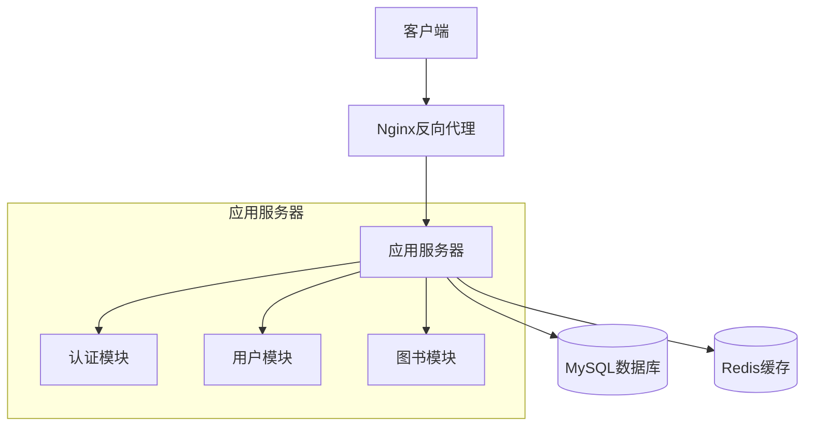
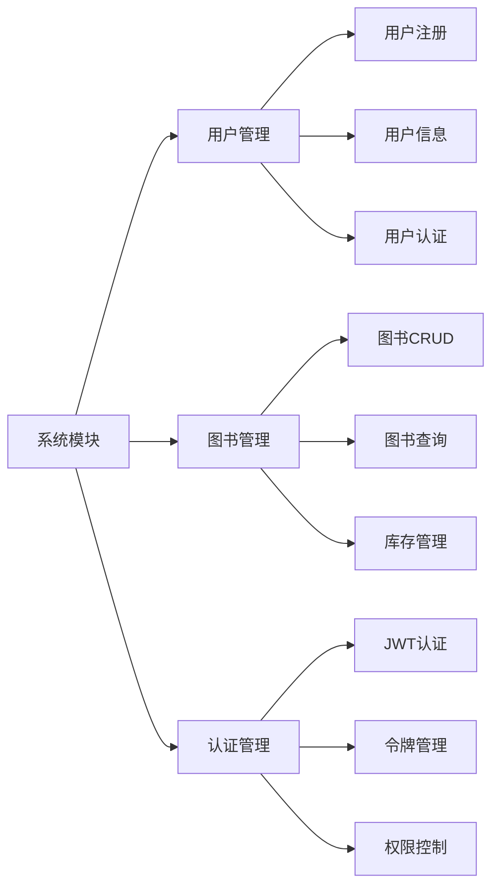
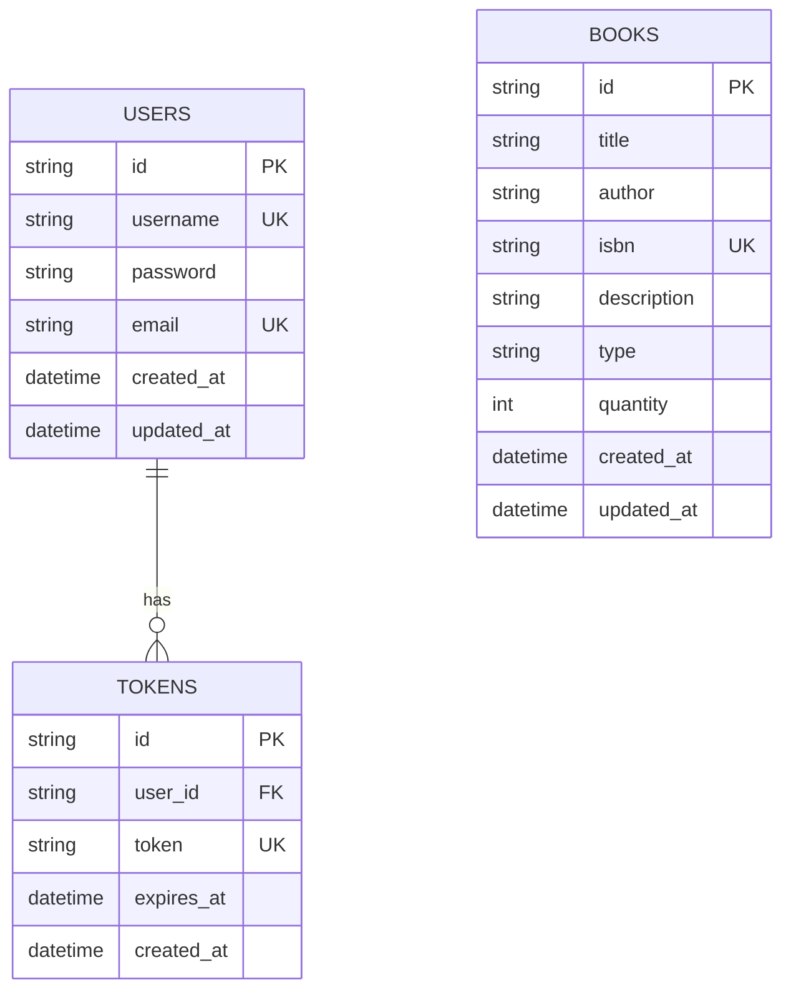
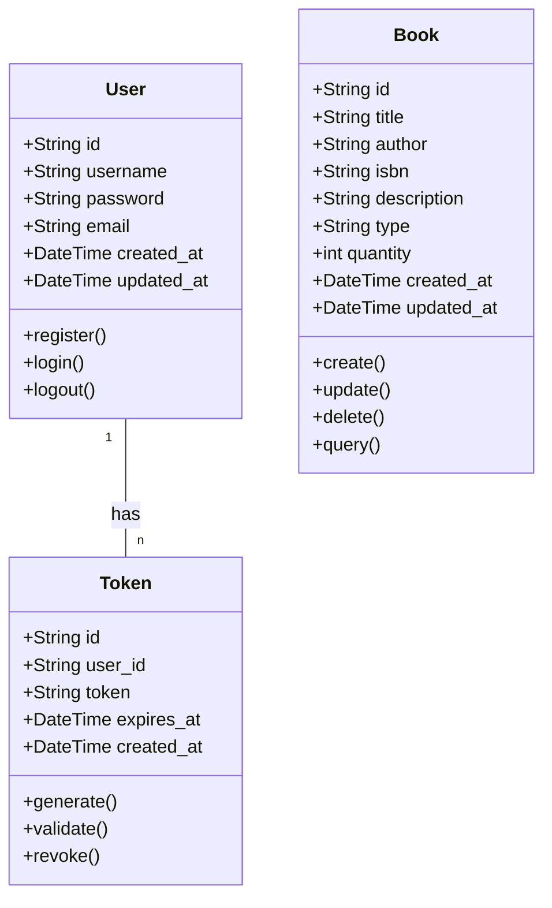
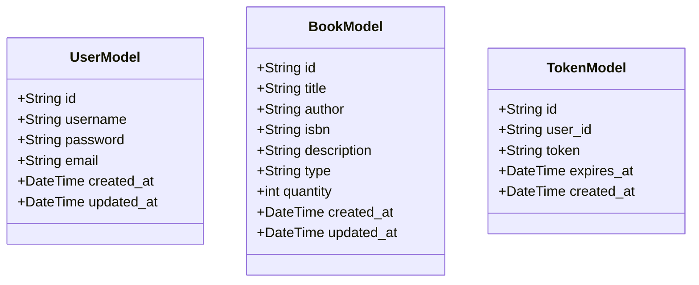
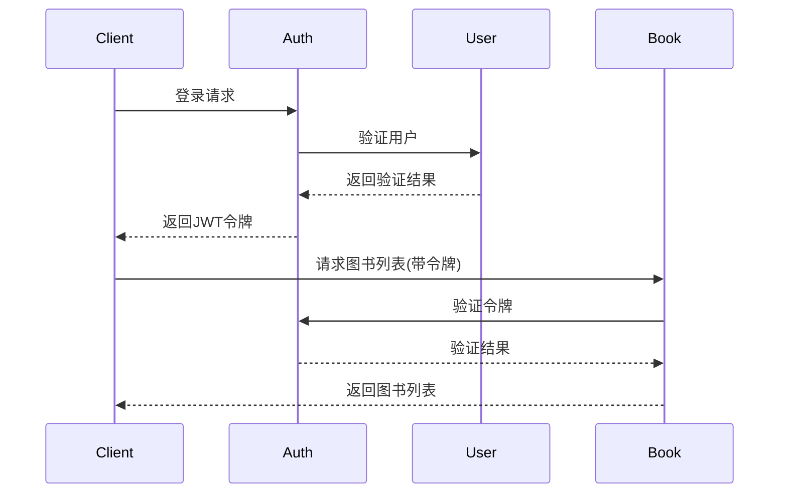
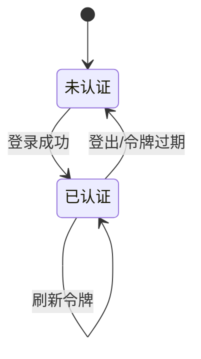
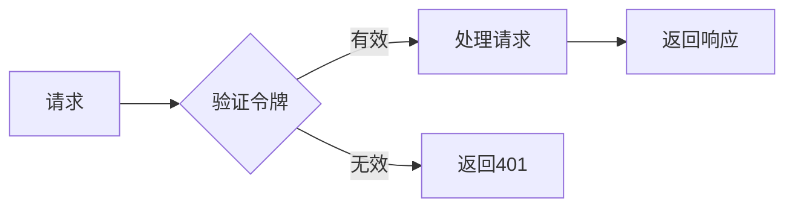
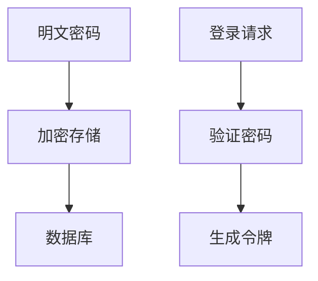

# 图书馆管理系统设计文档

## 1. 系统架构设计

### 1.1 整体架构

### 1.2 模块划分

## 2. 数据库设计

### 2.1 ER图

### 2.2 实体关系说明

1. 用户（USERS）
   - 主键：id（UUID）
   - 唯一约束：username, email
   - 与令牌是一对多关系

2. 图书（BOOKS）
   - 主键：id（UUID）
   - 唯一约束：isbn
   - 包含库存数量字段

3. 令牌（TOKENS）
   - 主键：id（UUID）
   - 外键：user_id（关联USERS表）
   - 唯一约束：token
   - 包含过期时间

## 3. 类设计

### 3.1 核心类图

### 3.2 数据模型类

## 4. 接口设计

### 4.1 接口时序图

### 4.2 认证流程

## 5. 安全设计

### 5.1 认证流程

### 5.2 数据加密
